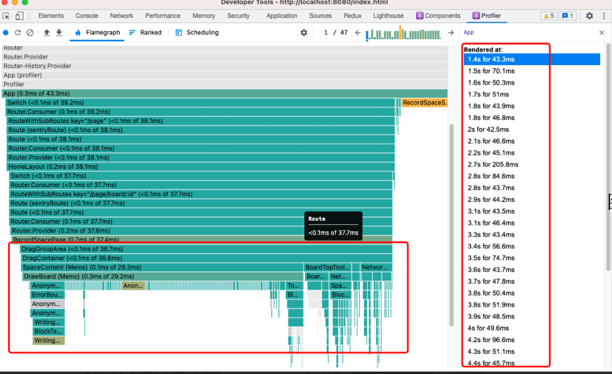

### The optimization of rendering user's video avatar

#### background

In the process of updating our product, we included a feature related to
audio/video that allows user's video avatar to follow the movement of the mouse
and also supports limiting the scaling of the avatar. However, in the initial
version, we encountered some issues with the avatars drifting off target and
lagging, as outlined below: 

#### Analysis of the issue:

1. Tasks on the main thread were all marked as `long tasks`, highlighted with a
   red tag; 
2. Upon examining the activities on the main thread in the performance panel, we
   found that during these long tasks, the `Event:mousemove` accounted for 76.4%
   of the time. Within this time, `dispatchUserBlockingUpdate` took up 58.4% of
   the time. As shown below: 
   

The reasons for this excessive time consumption could be due to frequent and
substantial updates or prolonged computations.

3. Looking over the memory usage. It soars. 

4. I opened the React Profiler and recorded the activity of other's mouse
   movement. I noticed that just moving the mouse caused many unrelated
   components to update, as shown below: 

The reasons for this are as follows: a. The data for the mouse trails, called
userCursorMap, is stored in the RecordSpace store, which also holds many other
space-related data items.

```
interface RecordState {
    a: string
    b: boolean
    .....
    userCursorMap:{
        [id:string]:{x:number,y:number}
        }
}
```

b. When other modules use this store, they reference it incorrectly, leading to
updates in any data within RecordSpace would affect all components that depend
on it.

**_Bad Example_**

```
const CompA = ()=>{
   const {a} = useAppSelector((state)=> state.recordSpace);
}
const CompB = ()=>{
   const {b} = useAppSelector((state)=> state.recordSpace);
}
const UserCursor =()=>{
   const {userCursorMap} = useAppSelector((state)=> state.recordSpace);
}
```

**_Good Example_**

```
const CompA = ()=>{
   const a = useAppSelector((state)=> state.recordSpace.a);
}
const CompB = ()=>{
   const b = useAppSelector((state)=> state.recordSpace.b);
}
const UserCursor =()=>{
   const userCursorMap = useAppSelector((state)=> state.recordSpace.userCursorMap);
}
```

### solutions

#### #1 Using rAF to debounce

In the lifecycle of a frame, rAF sits between the `begin frame` and the `layout`
phase. This allows us to handle some calculations, syncing each frame of an
animation with the screen's refresh rate to speed up the process and reduce lag.

```
const useUserCursor = ()=> {
  const [x,setX] = useState<number>();
  const [y,setY] = useState<number>();
  const mouse = useMouse();

  const renderAnimation = () => {
    requestAnimationFrame(()=>{
        const {oX,oY} = getAbosulteByRelateXY(mouse.clinetX,mouse.clientY);
    });
    setX(oX);
    setY(oY);
  };

  useEffec(()=>{
    renderAnimation();
  },[mouse])
}
```

#### #2 usSelector optimization

As shown above in the bad and good examples.

After optimization,

1. the average task time on the main thread has dropped from 84ms to 14ms, and
   the event time for 'pointermove' has also decreased to 4.3ms.
   

2. The memory usage on the page has returned to a normal fluctuation.
   

3. The updates to the mouse component from others now solely depend on the
   movement of their mouse. 

and finally, we have gotten this:  It
lookes much smoother.

However, the story has not yet come to an end. Let us explore a little bit more:

#### #3 forcus on the browser rendering process

At the same time, we noticed a high frequency of layout shifts shown on the
performance panel. When we checked the `Frames` section, it became clear that a
layout reflow occurred every 16.7ms (each frame). This issue stems from our use
of the `requestAnimationFrame (rAF)`, which schedules the changes within a
frame's cycle. During this cycle, after obtaining the x and y coordinates, we
directly altered the element's position using `'position'`, which caused the
layout shifts, as shown in the diagram below. This approach is costly because
every change in style that moves the position triggers updates across the entire
rendering pipeline—from `layout` to `layer`, then `paint`, and finally to
`composition`. This results in significant overhead.
 

By switching from using `'position'` to `'transform'`, we can bypass the
`layout` and `paint` stages, allowing the animation to run on a non-main thread.
This approach is highly efficient because it offloads the work to a secondary
thread, freeing up the main thread's resources and skipping the layout and
painting phases.

```
// change postion to transform

// positon:
style = {{position: 'fixed',left: x + "px" , top: y + "px" }}

// trasform
style ={{transform:`translate(${x}px,${y}px)`}}
```


After optimizing, there's no longer any dense layout shifting. In each task, the
re-layout process is skipped, and all changes occur on the compositing thread.
This makes the animation smoother and more resource-efficient.

 

#### #4 using API for help

To optimize frequent operations like moving and scaling avatars, we use the
`transform` property. Another advantage of handling animations directly in the
compose thread is that we can use the `will-change` property. This tells the
rendering engine in advance that we plan to apply special effects
transformations to an element. The engine then processes these transformations
on a separate layer, which are handled directly by the composite thread without
involving the main thread. This significantly boosts rendering efficiency.

```
// css
will-change: transform
```

Additionally, upgrading from `translate` to `translate3d` can enhance
performance. `translate3d` enables GPU acceleration for 3D transformations,
making it more efficient than the standard `translate`.
